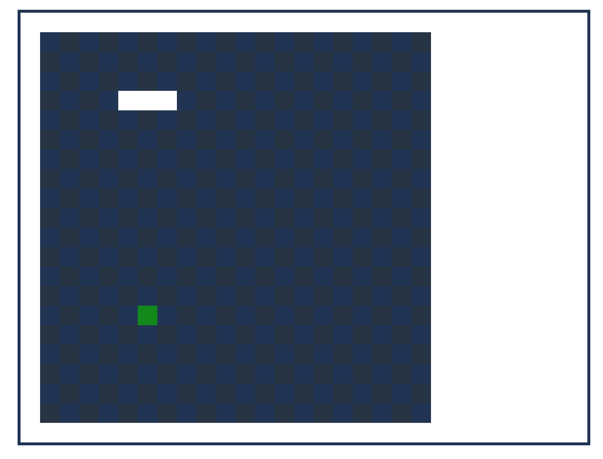

# Snake Game with Genetic Algorithm

This project is my implementation of a simple Snake game. It can be played by the user but also by AI using genetic algoritm.  

## Getting started

In this project, I focused on implementation of genetic algorithm for Snake game. AI is supposed to learn to maximazie the score and to grow while ommitting walls and its own body.

### Genetic algorithm 

Every population of snakes consists of some number of brains, which are neural nets that process information about snake percetion of the environment and generate an action for it. An input to the net is a N x N matrix of the cells near the head of the snake, mapped into a vector. Net has two hidden layers, which contain 25 neurons. An output is one of the particular actions snake can make: go left, right, up, down. For acting in the environment, snake is rewarded or punished.

 

Every generation of snakes evolves. 25% of the population, that acted the best, is crossovered and mutated with each other and with newly generated brains.

So far, the snake hasn't been able to achieve satisfying results, even after quite big number of generations. It has only been able to collect few (max 4) pieces of food. But it seems to understand hot to search for the food. So obviously, this project will still be developed.